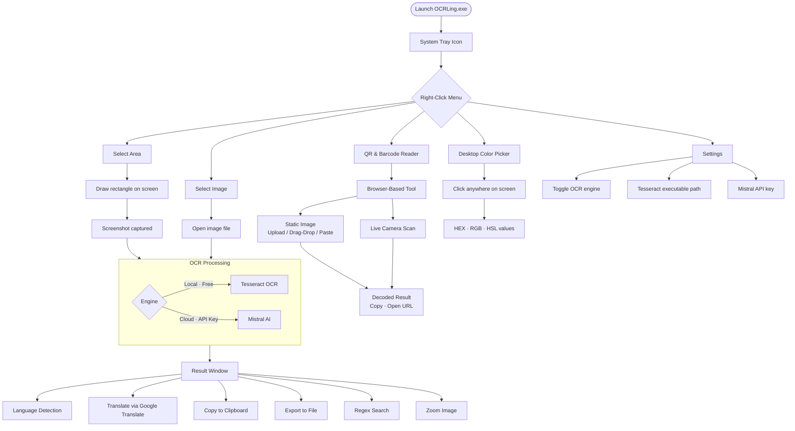

# OCRLing

A standalone Windows desktop OCR tool that lives in your system tray. It extracts text from screen regions or image files using **Tesseract** (local, free) or **Mistral AI** (cloud, high-accuracy), detects languages, translates text, and includes a browser-based **QR & Barcode Reader** and a **Desktop Color Picker**.

No Python installation required — just extract the ZIP and run `OCRLing.exe`.

**Download:** [OCRLing_v1.0.1](https://drive.google.com/file/d/1GjkFEgafQAvWVPMqzKtMXLDGJntuW5AU/view?usp=sharing)

---

## How It Works

---

## Features

### OCR Workflows

| Feature | Details |
|---|---|
| **Select Area OCR** | Draw a rectangle on any part of the screen - that region is captured and sent for OCR |
| **Select Image OCR** | Browse for any image file (PNG, JPG, etc.) and extract its text |
| **Dual OCR engines** | Switch between **Tesseract** (offline, free) and **Mistral AI** (cloud, higher accuracy) in Settings |
| **Language detection** | Automatically identifies the language of extracted text via [langdetect](https://github.com/Mimino666/langdetect) |
| **Translation** | Translate extracted or detected text to any language using Google Translate |
| **Regex search** | Search within extracted text using regular expressions |
| **Export** | Save extracted or translated text to a file |
| **Image zoom** | Pan and zoom the source image inside the result window |
| **Scrollable windows** | All result windows have vertical scrollbars and are freely resizable |
| **Loading animation** | Animated overlay confirms OCR is running; UI stays responsive (background thread) |

### QR & Barcode Reader

Browser-based - all decoding happens locally on your device, no uploads:

| Feature | Details |
|---|---|
| **Static image** | Upload, drag-and-drop, paste, or use clipboard - supports all common formats |
| **Live camera** | 15 fps continuous scan with a green highlight overlay on detected codes |
| **Image enhancement** | Brightness, Contrast, Binarize, Grayscale, Invert, Sharpen - real-time preview |
| **Supported formats** | QR Code, Aztec, Data Matrix, MaxiCode, PDF-417, Code 39/93/128, EAN-8/13, UPC-A/E, Codabar, ITF, RSS |
| **Result actions** | Copy to clipboard or open decoded URL directly |

### Desktop Color Picker

Click anywhere on the screen to capture the pixel color. Outputs **HEX**, **RGB**, and **HSL** values - handy for UI design, RPA automation, and accessibility work.

### Application Logging

- Logs written to `./logs/application.log`
- Daily rotation, 1-month retention
- Format: `{time} | {process} | {level} | {file} | {module}:{function}:{line} | {message}`

---

## Prerequisites

| Requirement | Notes |
|---|---|
| Windows 64-bit | Required |
| Tesseract OCR | Needed for the Tesseract engine - [install guide below](#install-tesseract-ocr) |
| Mistral AI API Key | Needed only for the Mistral engine - [get a key below](#get-a-mistral-ai-api-key) |
| Archive tool | [7-Zip](https://www.7-zip.org/) recommended for extracting the release ZIP |
| Folder permissions | Read, Write, Execute on the OCRLing install folder |
| Display resolution | Minimum **1280 × 960 px** - smaller resolutions cause UI elements to be cut off |

---

## Installation

1. Download `OCRLing_v1_0_1.zip` from the [Releases](../../releases) page or the [Google Drive link](https://drive.google.com/file/d/1GjkFEgafQAvWVPMqzKtMXLDGJntuW5AU/view?usp=sharing)
2. Extract to a local folder where you have Read, Write, and Execute permissions
3. Double-click **OCRLing.exe** - no Python or library installation needed
4. After a few seconds the app loads into the system tray (check the hidden icons area in the taskbar)
5. **Right-click the tray icon** to access all features

---

## Setup

### Install Tesseract OCR

1. Visit the [Tesseract wiki](https://github.com/UB-Mannheim/tesseract/wiki) and download the Windows installer
2. Run the installer - select any additional language packs you need
3. Note the installation path (e.g. `C:\Program Files\Tesseract-OCR\tesseract.exe`)
4. In OCRLing → right-click tray → **Settings** → paste the Tesseract executable path

Full step-by-step screenshots: [docs/help.html](docs/help.html)

### Get a Mistral AI API Key

1. Sign up or log in at [console.mistral.ai](https://console.mistral.ai/)
2. Go to **API Keys** → **Generate new key**
3. Copy the key
4. In OCRLing → right-click tray → **Settings** → paste the Mistral API key

### Add OCRLing to Windows Startup (optional)

1. Press `Win + R` → type `shell:startup` → press Enter
2. Create a shortcut to `OCRLing.exe` in that folder
3. OCRLing will now start automatically when you log in

---

## Usage

All features are accessed by **right-clicking the OCRLing system tray icon**:

| Menu Option | What it does |
|---|---|
| **Select Area** | Draw a rectangle on screen → the selected area is OCR'd |
| **Select Image** | Browse for an image file → the image is OCR'd |
| **QR & Barcode Reader** | Opens the browser-based decoder tool |
| **Desktop Color Picker** | Click any pixel on screen → get its HEX, RGB, HSL values |
| **Settings** | Configure OCR engine, Tesseract path, Mistral API key |
| **Help** | Open the full documentation in your browser |
| **About** | Version and build information |
| **Exit** | Close OCRLing |

---

## Troubleshooting

**QR/barcode not detected?**
- Use the image enhancement controls: increase Contrast, enable Binarize, or apply Sharpen
- Make sure the code is not blurry, rotated, or partially cropped
- For small codes, zoom in before scanning

**UI elements cut off or window too small?**
- Minimum supported resolution is 1280 × 960 px

**Translation stops partway through?**
- Google Translate has a per-request character limit - split very long texts into smaller chunks

**Settings not persisting?**
- Ensure OCRLing is stored in a folder where your user account has Write permissions

**OCR produces garbled text?**
- For Tesseract: make sure the correct language pack is installed and the image is clean and high-contrast
- For Mistral: verify the API key is valid and the account has available credits

---

## Built With

| Library | Purpose |
|---|---|
| [Python 3.13.9](https://www.python.org/downloads/release/python-3139/) | Runtime |
| [customtkinter](https://customtkinter.tomschimansky.com/) | Modern UI |
| [Tesseract OCR](https://github.com/UB-Mannheim/tesseract/wiki) | Local text recognition |
| [Mistral AI](https://mistral.ai/) | Cloud text recognition |
| [langdetect](https://github.com/Mimino666/langdetect) | Language detection |
| [googletrans](https://github.com/ssut/py-googletrans) | Translation |
| [Loguru](https://github.com/Delgan/loguru) | Application logging |
| [ZXing-js](https://github.com/zxing-js/library) | QR/barcode decoding |
| [html5-qrcode](https://github.com/mebjas/html5-qrcode) | Live camera scanning |
| [Icons8](https://icons8.com/icons/set) | Icons |

---

## Documentation

Full documentation with step-by-step screenshots lives in the [`docs/`](docs/) folder:

- [`docs/help.html`](docs/help.html) - Complete usage and setup guide
- [`docs/release_notes.html`](docs/release_notes.html) - v1.0.1 release notes
- [`docs/qr_barcode_reader.html`](docs/qr_barcode_reader.html) - Standalone QR & Barcode decoder (open directly in browser)

> To browse the docs locally: clone or download the repo, then open `docs/help.html` in any browser.
